# clouds-rusben
## **Crear maquina virtual**

EL primer paso para instalar nuestras clouds es crear la maquina virtual, para ello  entramos en el isardvdi i darle a escritorio nuevo

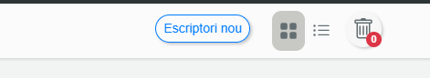

Despues le pondremos el nombre i la descripcion que nosotros queramos a la maquina.

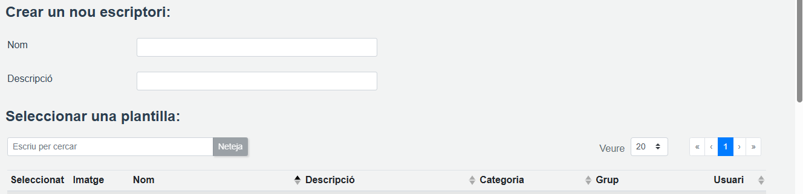

Elegimos es sitema operativo que vallamos a utilizar i le damos a crear

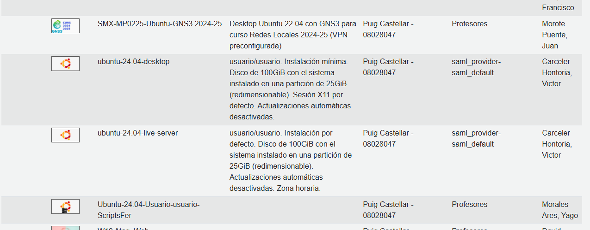

# Descargar nextcloud

El primer pàso es entrar en la terminal i actualizar. utilizando el comando sudo apt update.

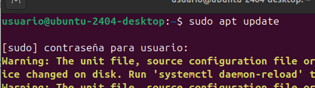

Luego usamos sudo apt update.

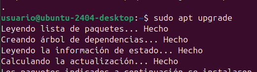

Despues tendremos que descargar apache2 usando el comando sudo apt insatall -y apache2.

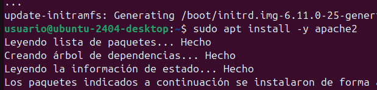

Despues instalaremos el servidor de la base de datos.

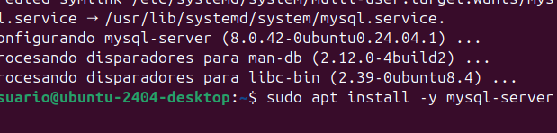

Isntalaremos unas cuantas librerias de php.

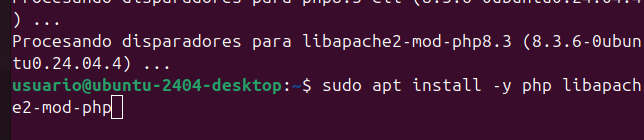

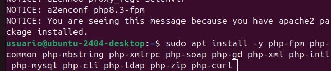

I reiniciaremos el sistema.

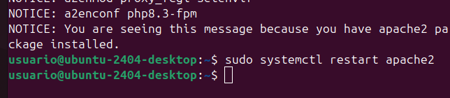

Despues configuraremos el MySQL.

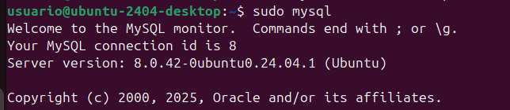

I crearemos la base de datos.

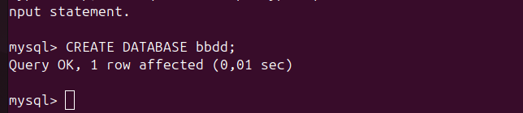

Creamos un usuario.

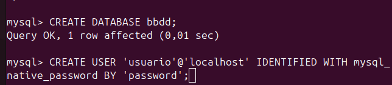

Le damos privilegios.

Salimos i provamos la conexion para ver si lo hemos echo bien.

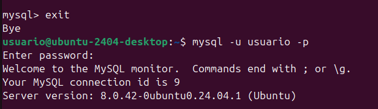

luego descargamos los .zip de la cloud desde una de estos enlaces i copiaremos el zip en el directorio /var/www/html

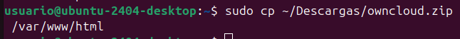

https://download.nextcloud.com/server/releases/latest.zip

Una vez echo esto entraremos aldirectorio.

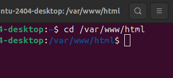

I descomprimimos el zip.

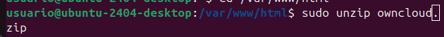

Borramos el archivo index.html del apache2.

Una vez descimprimido aplicamos los siguientes permisos.

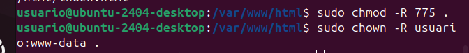

I entramos a la direccion http://localhost i nos aparecera lo siguiente.

# Configuracion

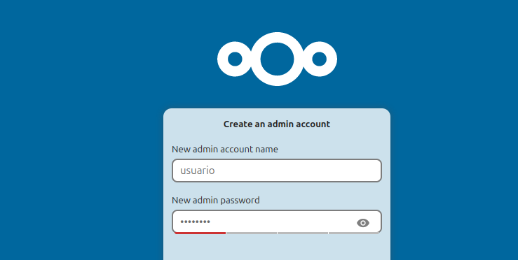

Rellenamos los datos i pasamos las vetanas emergentes que nos aparecen.

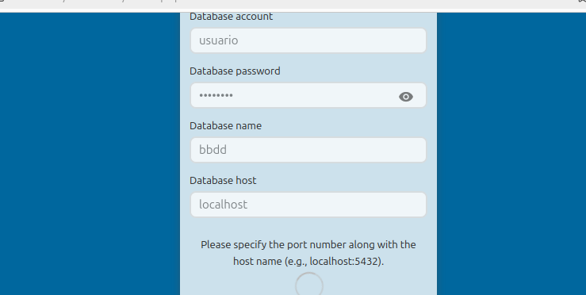

Hasta llegar al menu.

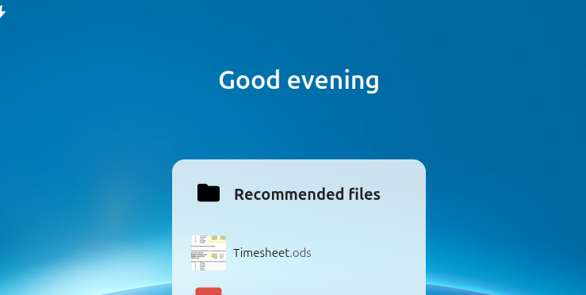

## **subir archivos i crear carpetas**

Para crear una carpeta tendremos que darle a la carpeta de arriba a la derecha i nos llevara a un menu donde tendremos que darle a new folder.

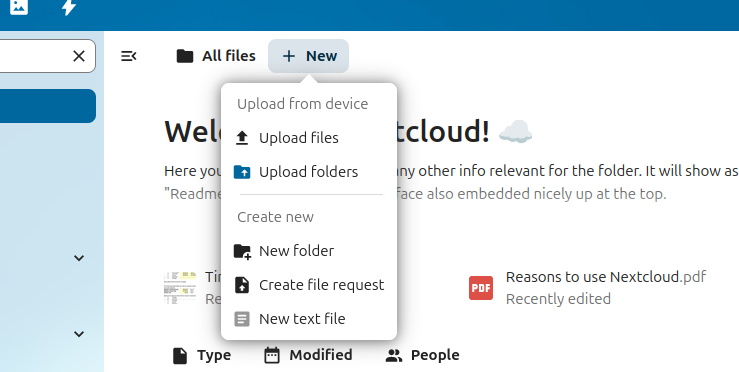

I elgimos el nombre de la carpeta.

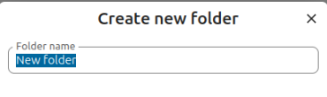

Una vez creada la carpeta para subir archivos le damos a upload files i elegimos el archivo.

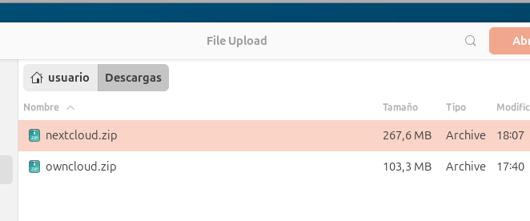

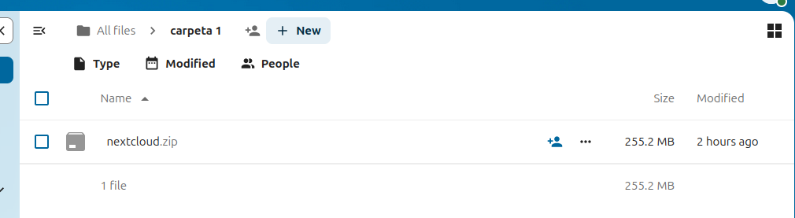

## **compartir**
Para compartir un archivo tendres que darle a los tres puntos al lado del nombre del archivo/carpeta i darel a sharing, tendremos dos opciones o crear un enlace o poner el correo de la parsona a la que se lo queremos compartir.

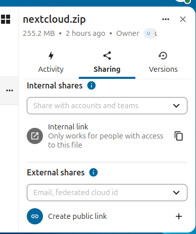

## **usuarios i grupos**

Para crear un usuario tendremos que darle a nuestro perfil i darle al boton agregar lo cual nos llevara a al siguiente pantalla en la cual tendremos que darle a nueva cuenta para agregar un usuario.

Rellenamos los datos i listo.

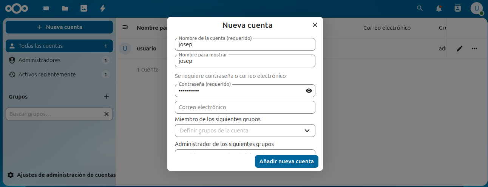

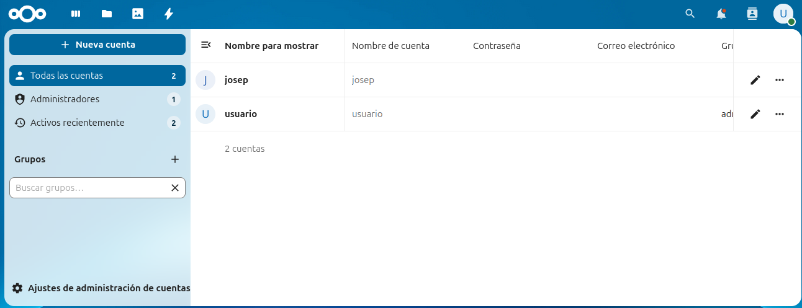

I repetimos para crear mas.

Para crear un grupo es parecido, simplemente le damso a el + i elegimos el nombre del grupo.

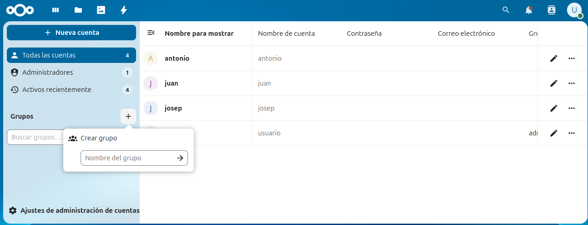

## **roles**

Para los roes tendremos que crear diversos grupos i ir añadiendo los usuarios.

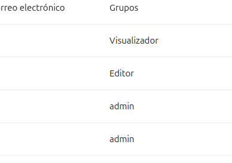

## **organizar**

Para organizar archivo tendremos que darle a los tres puntos que se ven en la imagen i darle a mover o copiar.

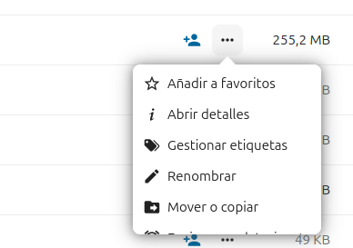

Una vez echo nos aparecera la siguiente pantalla en la cual podremos organizar los archivos como queramos.

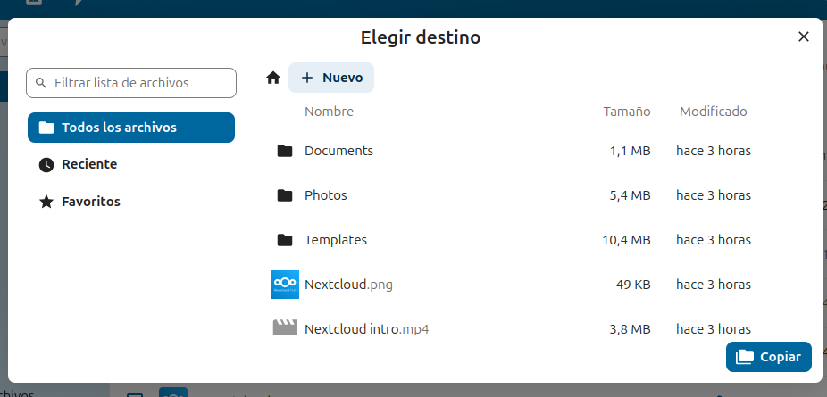

## **Enlaces**

para configurar un enlace tendremos que meternos en el apartado sharing i tendremos que darle a I darle a creata public link.

nos aparecera lo siguiente. 

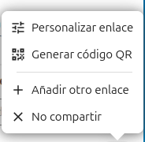

I tendremos que darle a personalizar enlace i nos aparecera un menu en el que podremos modificar el enlace.

# Descargar owncloud

El primer pàso es Entrar a la terminal i actualizar utilizando el comando sudo apt update.

Luego usamos sudo apt update.

Despues tendremos que descargar apache2 usando el comando sudo apt insatall -y apache2.

Despues instalaremos el servidor de la base de datos.

Instalaremos los requisitos previos de PPA.

Despues instalaremos las herramientas que necesitamos para trabajar con los paquetes PPA.

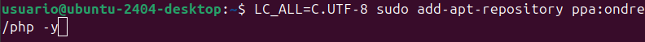

Actualizamos el repositorio.

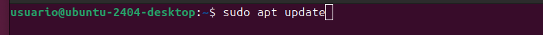

Despues descargaremos las librerias PHP version 7.4

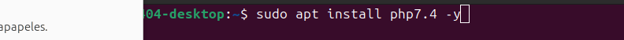

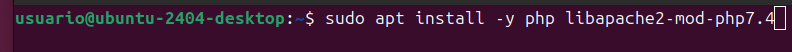

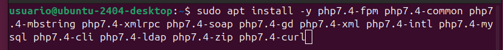

Despues tendremos que elegir la version de PHP que queremos utilizar para ello ponemos el siguiente comando el cual nos enseñara todos los PHP que tenemos i un numero al lado, buscamos la version 7.4 i ponemos el numero   que nos salga en mi caso es 1.

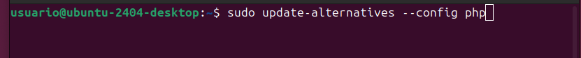

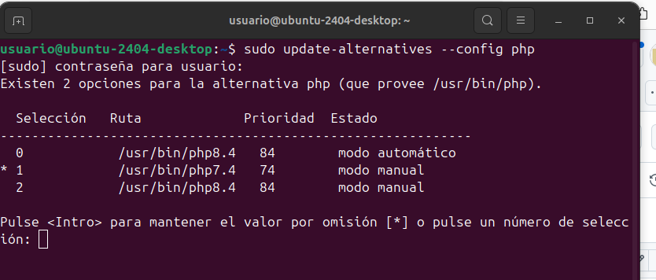

Despues activaremos los modulos necesarios.

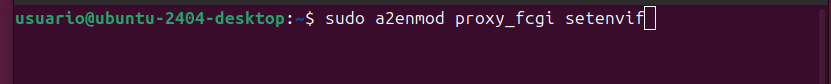

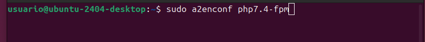

I reiniciaremos el sistema.

Despues configuraremos el MySQL.

I crearemos la base de datos.

Creamos un usuario.

Le damos privilegios.

Salimos i provamos la conexion para ver si lo hemos echo bien.

luego descargamos los .zip de la cloud desde una de estos enlaces i copiaremos el zip en el directorio /var/www/html

[https://download.nextcloud.com/server/releases/latest.zip](https://download.owncloud.com/server/stable/owncloud-complete-20240724.zip)

Una vez echo esto entraremos aldirectorio.

I descomprimimos el zip.

Borramos el archivo index.html del apache2.

Una vez descimprimido aplicamos los siguientes permisos.

I entramos a la direccion http://localhost i nos aparecera lo siguiente.

