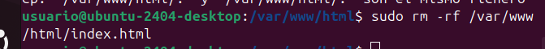

# clouds-rusben

El primer paso para descargar nuestra cloud es seguir los pasos de la siguiente guia depiendiendo de si queremos descargar owncloud o nextcloud
[manual ](https://github.com/rusben/smx-m08/blob/main/docs/installacio-clouds.md)

El primer pàso es actualizar. utilizando el comando sudo apt update.

luego usamos sudo apt update

Despues tendremos que descargar apache2 usando el comando sudo apt insatall -y apache2.

Despues instalaremos el servidor de la base de datos.

Isntalaremos unas cuantas librerias de php.

i reiniciaremos el sistema.

despues configuraremos el MySQL

i crearemos la base de datos

Creamos un usuario.

Le damos privilegios.

salimos i provamos la conexion para ver si lo hemos echo bien.

luego descargamos los .zip de la cloud desde una de estos enlaces i copiaremos el zip en el directorio /var/www/html

https://download.nextcloud.com/server/releases/latest.zip

https://download.owncloud.com/server/stable/owncloud-complete-20240724.zip

una vez echo esto entraremos aldirectorio.

i descomprimimos el zip

Borramos el archivo index.html del apache2

una vez descimprimido aplicamos los siguientes permisos

i entramos a la direccion http://localhost i nos aparecera lo siguiente

rellenamos los datos i pasamos las vetanas emergentes que nos aparecen.

Hasta llegar al menu.

## **subir archivos i crear carpetas**

Para crear una carpeta tendremos que darle a la carpeta de arriba a la derecha i nos llevara a un menu donde tendremos que darle a new i a upl

